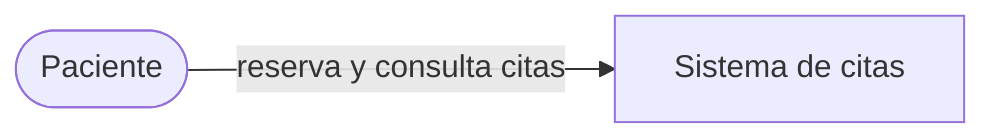

# Vista de Contexto (C4 nivel 1)

**Público:** negocio y cualquier persona no técnica.
**Pregunta que responde:** ¿quién usa el sistema y con qué otros sistemas se habla?
**Regla:** no aparece ninguna tecnología (ni Kafka, ni Spring, ni Postgres).

TODO: dos líneas que expliquen en palabras de negocio qué hace el sistema.
