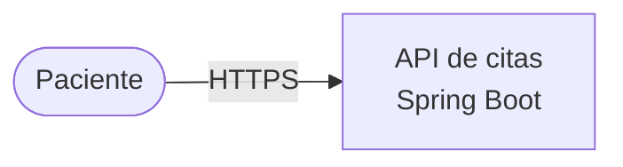

# Vista de Contenedores (C4 nivel 2)

**Público:** líder técnico, equipo de infraestructura.
**Pregunta que responde:** ¿de qué piezas desplegables se compone y cómo se hablan?
**Regla:** cada caja es algo que se despliega o guarda datos; cada flecha lleva protocolo y qué viaja.

TODO: una tabla con cada contenedor, su tecnología y su responsabilidad en una línea.
