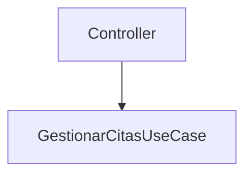

# Vista de Componentes de la API de citas (C4 nivel 3)

**Público:** desarrolladores.
**Pregunta que responde:** ¿cómo está organizado por dentro el contenedor API de citas?

```mermaid
flowchart TB
    controller[Controller] --> usecase[GestionarCitasUseCase]
    %% TODO: puerto CitaRepositoryPort, adaptador JPA y de memoria, productor de eventos
    %% TODO: la dependencia siempre apunta hacia el dominio (reto 11)
```
