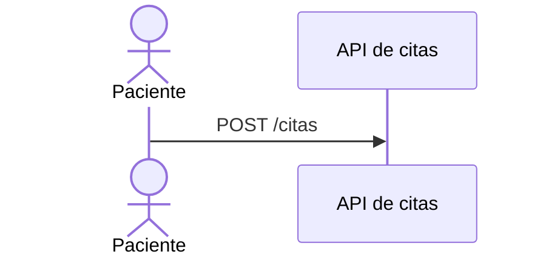

# Secuencia: reservar una cita

```mermaid
sequenceDiagram
    actor Paciente
    participant API as API de citas
    %% TODO: use case, repositorio, productor de eventos, Kafka
    Paciente->>API: POST /citas
    %% TODO: flujo feliz completo
    %% TODO: alt/else para horario ocupado (qué responde y qué NO se publica)
```
