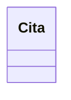

# Diagrama de clases del dominio

```mermaid
classDiagram
    class Cita {
        %% TODO: atributos y métodos reales de tu modelo (reto 11)
    }
    %% TODO: relaciones (Doctor, Horario...) con su cardinalidad
```
