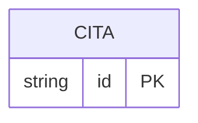

# Entidad-relación

```mermaid
erDiagram
    CITA {
        string id PK
        %% TODO: columnas reales de tu CitaEntity (reto 11) y llaves foráneas
    }
    %% TODO: otras entidades y relaciones
```
