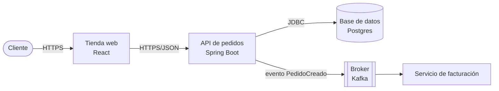

# Hoja de retos — Assessment Pragma
**Un reto autocontenido por tema, con ejemplo de la técnica en un dominio distinto. Resuélvelos sin IA, sin mirar el documento de conceptos, como si fuera la prueba real.**

Cada reto trae: el enunciado, qué debes entregar, "demuestra dominio si..." (lo que te preguntaría el evaluador), y un ejemplo de la técnica aplicado a un dominio **distinto** al del reto — para que veas cómo se hace sin que sea copiar-pegar la respuesta. Cerrá el ejemplo y escribí tu solución real desde cero.

Formato de entrega sugerido: un repo/carpeta por tema, o un solo proyecto Maven multi-paquete. Java + Spring Boot donde aplique.

---

## Tu evaluador real: Rudyard Fuji Vásquez Izquierdo

8 años como Technical Leader / Back End Developer (Mercania y Chazki, Perú), antes Analista de Soluciones y Back End en core bancario. Esto importa porque un evaluador pregunta más profundo en los temas donde **él mismo tiene cicatrices reales** — ahí es donde te va a repreguntar "¿y si...?" hasta encontrar el límite de tu entendimiento. En los temas donde no tiene experiencia directa, suele quedarse en la pregunta de concepto.

| Probabilidad | Temas | Por qué (evidencia en su CV) |
|---|---|---|
| 🔴 Alta | 15-Reactivo, 10-Cache, 11-Clean-Architecture, 2-SOLID, 12-GoF, 9-Protocolo, 18-OWASP | Lideró la **migración de POO a programación funcional con Spring WebFlux** (Mercania) — es la coincidencia más directa de todo el CV. Además: Redis explícito, arquitectura de microservicios en dos empresas, "SOLID, Patrones de Diseño, Clean Code" listado en AMBOS trabajos, SOAP en core bancario + APIs REST para B2B, JWT en ambos roles. |
| 🟡 Media | 5-Arquitectura-Capas, 6-GRASP, 7-Normalización-BD, 13-Resiliencia, 16-EDA, 8-Uso-IA | Trabajó con SQL Server/MySQL/Postgres (modelado de datos) y lideró "middleware para comunicación entre plataformas" (concepto cercano a EDA, aunque no nombra Kafka/RabbitMQ puntual). Resiliencia no aparece explícita, pero microservicios en producción la implica. |
| 🟢 Baja | 3-Excepciones, 4-Estructuras-Datos, 14-BDD, 17-IaC, 19-DDD | No hay evidencia directa en su CV (no menciona Cucumber/Karate, ni Terraform/CloudFormation, ni DDD como tal). Probablemente los pregunte a nivel de concepto general, no de "cuéntame un caso real que viviste". |

**Cómo usar esto:** no te saltes ningún reto — igual todos están en tu assessment — pero si el tiempo aprieta, resuelve primero los 🔴 Alta con el nivel de profundidad más alto posible (no solo que compile, que puedas defender cada decisión). En los 🔴 vas a ver un aparte "🎯 Con Rudyard" con la pregunta específica que es más probable que te haga, basada en su experiencia real.

---

# TRAINER

## 1. POO
**Reto:** Modela un sistema de nómina con `Empleado` (clase abstracta) y dos tipos, `EmpleadoFijo` (salario fijo) y `EmpleadoPorHoras` (salario = horas × tarifa), cada uno con su propia lógica de `calcularSalario()`. Agrega una interfaz `Bonificable { double calcularBono(); }` que solo implementa `EmpleadoFijo`. Crea una clase genérica `Nomina<T extends Empleado>` que reciba una lista de empleados y calcule el total a pagar sin usar `instanceof` en ningún punto.

**Entrega:** código + un párrafo explicando qué pasaría si agregas un tercer tipo `EmpleadoComisionista` — qué archivos tocas y cuáles no.

**Demuestra dominio si:** puedes explicar por qué `Nomina<T>` no necesita saber qué tipo concreto de empleado está sumando, y qué diferencia hay entre eso y usar `List<Object>` con casts.

**Ejemplo (dominio: zoológico):**
```java
abstract class Animal {
    String nombre;
    abstract String hacerSonido();
}
class Perro extends Animal {
    String hacerSonido() { return "Guau"; }
}
class Gato extends Animal implements Entrenable {
    String hacerSonido() { return "Miau"; }
    public void entrenar() { System.out.println(nombre + " aprendió un truco"); }
}
interface Entrenable { void entrenar(); }

class Zoologico<T extends Animal> {
    List<T> animales = new ArrayList<>();
    void agregar(T a) { animales.add(a); }
    void hacerRuido() {
        for (T a : animales) System.out.println(a.hacerSonido()); // sin instanceof
    }
}
```
**Cómo se traduce:** `Animal` → `Empleado`, `hacerSonido()` → `calcularSalario()`, `Entrenable` → `Bonificable` (solo `EmpleadoFijo` la implementa), `Zoologico<T>` → `Nomina<T>`.

---

## 2. Código limpio (SOLID/KISS/YAGNI/DRY)
**Reto:** Te dan (o escribes) una clase `ValidadorSolicitud` con un método de 40 líneas que valida un formulario de crédito: revisa edad, ingresos, historial, y según el resultado arma un mensaje, lo loguea, y lo envía por email — todo ahí mismo, con `if/else` anidados. Refactorízala en al menos 3 clases nuevas aplicando SRP y OCP (usa una lista de `ReglaValidacion` como Strategy en vez de `if/else`).

**Entrega:** código antes/después (aunque sea el "antes" resumido) + tabla de 3 columnas: principio aplicado, qué cambiaste, qué se rompería si no lo hubieras hecho.

**Demuestra dominio si:** puedes agregar una regla de validación nueva creando solo una clase, sin tocar ninguna de las existentes.

**🎯 Con Rudyard:** SOLID + Patrones de Diseño está en el stack técnico de sus dos roles como Technical Leader — no lo va a dejar en "sabe qué significa la S de SRP". Prepárate para que te pida nombrar, EN TU CÓDIGO, cuál principio rompiste primero (antes de refactorizar) y por qué el Strategy es mejor que solo dividir el método en 3 sin cambiar el diseño.

**Ejemplo (dominio: descuentos de una tienda):**
```java
interface ReglaDescuento {
    boolean aplica(Cliente c);
    double calcular(double total);
}
class DescuentoEstudiante implements ReglaDescuento {
    public boolean aplica(Cliente c) { return c.esEstudiante(); }
    public double calcular(double total) { return total * 0.9; }
}
class MotorDescuentos {
    List<ReglaDescuento> reglas;
    MotorDescuentos(List<ReglaDescuento> reglas) { this.reglas = reglas; }
    double aplicarDescuento(Cliente c, double total) {
        for (ReglaDescuento r : reglas)
            if (r.aplica(c)) return r.calcular(total);
        return total;
    }
}
```
**Cómo se traduce:** cada rama de tu `if/else` en `ValidadorSolicitud` (edad, ingresos, historial) se vuelve una clase `ReglaValidacion` con `aplica()`/`validar()`; `ValidadorSolicitud` queda como el `MotorDescuentos`: recibe la lista por constructor y solo orquesta.

---

## 3. Excepciones y depuración
**Reto:** Implementa `ProcesadorPagos.procesar(Pago pago)` que lance `SaldoInsuficienteException` (checked) si el monto excede el saldo disponible, y `PagoInvalidoException` (checked) si el monto es ≤ 0 — ambas con constructor que acepte causa encadenada. El método debe usar `try-with-resources` para "cerrar" un recurso simulado (`RegistroTransaccion implements AutoCloseable`). Escribe 3 pruebas: pago válido, saldo insuficiente, monto inválido.

**Entrega:** código + pruebas JUnit pasando.

**Demuestra dominio si:** puedes explicar, sin ver el código, en qué orden se ejecutan las cosas si `procesar()` lanza una excepción dentro del bloque `try-with-resources` — ¿se cierra igual el recurso?

**Ejemplo (dominio: inventario):**
```java
class StockInsuficienteException extends Exception {
    StockInsuficienteException(String msg, Throwable causa) { super(msg, causa); }
}
class ConexionAlmacen implements AutoCloseable {
    public void close() { System.out.println("Conexión cerrada"); }
}
class GestorInventario {
    void despachar(int cantidad, int stockDisponible) throws StockInsuficienteException {
        try (ConexionAlmacen conexion = new ConexionAlmacen()) {
            if (cantidad > stockDisponible) {
                throw new StockInsuficienteException("Pidieron " + cantidad + ", hay " + stockDisponible, null);
            }
            System.out.println("Despachado");
        }
    }
}
```
**Cómo se traduce:** `StockInsuficienteException` → `SaldoInsuficienteException`; `ConexionAlmacen` → tu `RegistroTransaccion`. Prueba en JUnit: `assertThrows(SaldoInsuficienteException.class, () -> procesador.procesar(pagoConMontoAlto))`.

---

## 4. Estructuras de datos
**Reto:** Dado un `List<String> transacciones` con formato `"cliente:monto"` (ej: `"ana:500"`, `"luis:300"`, `"ana:200"`), calcula el total por cliente en un `Map<String, Double>`, encuentra el cliente con mayor total, y devuelve la lista de clientes ordenada de mayor a menor total. Hazlo sin `Collectors.groupingBy` (a mano, con `getOrDefault`/`merge` y `Comparator`).

**Entrega:** código + tiempo estimado de tu solución en notación Big O para n transacciones.

**Demuestra dominio si:** puedes explicar por qué usaste `Map` y no simplemente recorrer la lista dos veces con `List`, y qué pasaría con el rendimiento si fueran 10 millones de transacciones.

**Ejemplo (dominio: votos):**
```java
List<String> votos = List.of("ana:10", "luis:5", "ana:3");
Map<String, Integer> totales = new HashMap<>();
for (String v : votos) {
    String[] partes = v.split(":");
    totales.merge(partes[0], Integer.parseInt(partes[1]), Integer::sum);
}
List<Map.Entry<String,Integer>> ordenado = new ArrayList<>(totales.entrySet());
ordenado.sort(Comparator.comparing((Map.Entry<String,Integer> e) -> e.getValue()).reversed());
System.out.println(ordenado); // [ana=13, luis=5]
```
**Cómo se traduce:** mismo patrón, pero `merge` acumula `Double` en vez de `Integer`, y tu ganador es "cliente con mayor total" en vez de "candidato con más votos".

---

## 5. Arquitectura de capas
**Reto:** Diseña (sin frameworks) un mini sistema de reservas de citas: `CitaRepository` (interfaz) + implementación en memoria, `CitaService` que valida que no haya dos citas en el mismo horario para el mismo doctor, y un "Controller" (clase simple con métodos que simula endpoints) que solo llama al Service.

**Entrega:** código + diagrama de texto (ASCII) mostrando qué capa llama a cuál.

**Demuestra dominio si:** puedes señalar exactamente en qué capa vive la regla "no dos citas en el mismo horario" y explicar por qué no debería estar en el Controller ni en el Repository.

**Ejemplo (dominio: préstamos de biblioteca):**
```java
interface PrestamoRepository {
    void guardar(Prestamo p);
    long contarActivosDe(String usuario);
}
class PrestamoService {
    PrestamoRepository repo;
    PrestamoService(PrestamoRepository repo) { this.repo = repo; }
    void prestar(String usuario, String libro) {
        if (repo.contarActivosDe(usuario) >= 3)
            throw new IllegalStateException("Ya tiene 3 préstamos activos");
        repo.guardar(new Prestamo(usuario, libro));
    }
}
// "Controller": solo llama al service
class BibliotecaController {
    PrestamoService service;
    void solicitarPrestamo(String usuario, String libro) { service.prestar(usuario, libro); }
}
```
**Cómo se traduce:** `PrestamoService.prestar` con la regla de "máximo 3 préstamos" es exactamente el mismo rol que tu `CitaService` validando "no dos citas en el mismo horario del mismo doctor".

---

## 6. Patrones GRASP
**Reto:** Sobre el sistema de citas del reto anterior, identifica y ajusta si hace falta: ¿quién calcula la duración total de las citas del día de un doctor (Experto en Información)? ¿quién crea las instancias de `Cita` — el Service directamente con `new`, o debería haber un método `crear()` en el propio agregado/clase relacionada (Creador)?

**Entrega:** el código ajustado + comentarios señalando exactamente la línea donde aplicaste cada patrón.

**Demuestra dominio si:** puedes nombrar una clase candidata alternativa para cada responsabilidad y explicar por qué la descartaste.

**Ejemplo (mismo dominio de biblioteca, aplicando GRASP):**
```java
class Prestamo {
    LocalDate fechaPrestamo;
    // Experto en información: Prestamo tiene los datos (fecha) para calcular su propia multa
    double calcularMulta(LocalDate hoy) {
        long diasAtraso = ChronoUnit.DAYS.between(fechaPrestamo.plusDays(14), hoy);
        return diasAtraso > 0 ? diasAtraso * 500 : 0;
    }
}
class Biblioteca {
    // Creador: Biblioteca contiene/usa Prestamo de cerca, tiene sentido que lo cree
    Prestamo crearPrestamo(String usuario, String libro) {
        return new Prestamo(usuario, libro, LocalDate.now());
    }
}
```
**Cómo se traduce:** en tu reto, `Cita` debería calcular su propia duración/solapamiento (Experto en Información) y `Doctor` o el propio agregado que agrupa citas debería tener el método `crear()` (Creador), en vez de que el Service arme `new Cita(...)` con lógica dispersa.

---

## 7. Normalización BD / modelo E-R
**Reto:** Normaliza hasta 3FN esta tabla:
```
Matriculas(id_matricula, estudiante_nombre, estudiante_documento, curso1_nombre, curso1_profesor, curso2_nombre, curso2_profesor)
```
**Entrega:** tablas finales con PK/FK marcadas + una frase por cada paso (1FN, 2FN, 3FN) diciendo qué dependencia resolviste.

**Demuestra dominio si:** puedes explicar qué problema de inconsistencia real evitas al separar `curso_profesor` en su propia tabla (piensa: ¿qué pasa si el mismo profesor aparece con dos nombres distintos en filas distintas antes de normalizar?).

**Ejemplo (dominio: ventas):**
Tabla de entrada: `Ventas(id_venta, vendedor_nombre, vendedor_telefono, articulo1, articulo1_precio, articulo2, articulo2_precio)`

- **1FN:** quito `articulo1/2` → `LineasVenta(id_venta FK, articulo, precio)`.
- **2FN:** no aplica dependencia parcial aquí porque no hay clave compuesta con atributos que dependan de solo una parte — se revisa igual, aquí ya queda limpio.
- **3FN:** `vendedor_telefono` depende de `vendedor_nombre`, no de `id_venta` directamente (transitiva) → separo `Vendedores(id_vendedor PK, nombre, telefono)` y dejo en `Ventas` solo `id_vendedor FK`.

Resultado: `Vendedores(id_vendedor PK, nombre, telefono)` — `Ventas(id_venta PK, id_vendedor FK, fecha)` — `LineasVenta(id_venta FK, articulo, precio)`.

**Cómo se traduce:** en tu reto, `curso1_profesor`/`curso2_profesor` es el grupo repetido (→ `Cursos` e `Inscripciones`), y si un profesor tuviera teléfono o email repetido por cada curso, esa sería tu dependencia transitiva a separar en `Profesores`.

---

# JUNIOR

## 8. Uso de asistente de IA en el desarrollo
**Reto (no es código):** Toma una tarea real de tu sprint actual en Entitlement.

**Demuestra dominio si:** tu evaluador podría preguntarte "¿por qué decidiste eso?" sobre cualquier parte de la tarea y responder sin necesitar abrir el chat de la IA.

**Ejemplo de cómo se ve una entrada bien hecha:**

| Tarea | ¿Usé IA? | Por qué |
|---|---|---|
| Generar los tests unitarios de un mapper ya diseñado | Sí | El diseño (qué casos probar) ya lo decidí yo; la IA solo escribió el boilerplate repetitivo |
| Decidir si usar Cache-Aside o Write-Through para el catálogo de tarifas | No | Es una decisión de trade-off (consistencia vs velocidad) que depende del negocio; tuve que entender el caso de uso real, no era mecánico |

**Cómo se traduce:** llena 3 filas de cada tipo con tareas reales tuyas de Entitlement, no genéricas.

---

# ADVANCED

## 9. Protocolo adicional a REST
**Reto:** Implementa un servidor WebSocket de notificaciones: cuando un cliente se conecta, recibe un mensaje de bienvenida; cuando cualquier cliente manda un mensaje tipo `{"tipo":"alerta","texto":"..."}`, todos los demás clientes conectados lo reciben, pero si el tipo es `{"tipo":"privado","destino":"id","texto":"..."}` solo le llega al cliente con ese id de sesión.

**Entrega:** código del servidor + captura o log mostrando el broadcast y el mensaje privado funcionando con al menos 3 clientes.

**Demuestra dominio si:** puedes explicar cómo garantizas que la lista de sesiones conectadas es segura ante acceso concurrente, y qué pasa si un cliente se desconecta abruptamente sin `onClose`.

**🎯 Con Rudyard:** su experiencia fuerte en protocolos es SOAP (core bancario legado) + REST/APIs para integraciones B2B, no WebSocket puntualmente. Probablemente no se quede en el WebSocket en sí — es más probable que te compare: "¿por qué aquí SÍ necesitas algo con estado/bidireccional y en tu integración B2B no?" (esa es la pregunta que él mismo se hizo migrando SOAP legado hacia APIs modernas).

**Ejemplo (dominio: contador de visitantes en vivo, más simple, para ver la estructura):**
```java
@ServerEndpoint("/visitantes")
public class VisitantesEndpoint {
    static Set<Session> sesiones = new CopyOnWriteArraySet<>();

    @OnOpen
    public void onOpen(Session session) {
        sesiones.add(session);
        broadcast("Visitantes conectados: " + sesiones.size());
    }
    @OnClose
    public void onClose(Session session) {
        sesiones.remove(session);
        broadcast("Visitantes conectados: " + sesiones.size());
    }
    static void broadcast(String msg) {
        for (Session s : sesiones) s.getAsyncRemote().sendText(msg);
    }
}
```
**Cómo se traduce:** en tu reto, en vez de `broadcast` simple, en `onMessage` parseás el JSON: si `tipo == "alerta"` recorrés todas las sesiones (como arriba); si `tipo == "privado"`, filtrás la sesión cuyo `session.getId()` coincida con `destino` y le mandás solo a esa.

---

## 10. Caché — Redis/Memcached y estrategias
**Reto:** Implementa Cache-Aside completo (lectura con *miss*/*hit*, invalidación en escritura) para un catálogo de precios, y agrégale **TTL**: cada entrada en cache expira sola a los 30 segundos aunque nadie la invalide. Luego, sin código, diseña por escrito cómo se vería el mismo catálogo con Write-Through (qué cambia en el método de escritura) y en qué escenario de tu proyecto real usarías cada estrategia.

**Entrega:** código + diseño escrito de Write-Through.

**Demuestra dominio si:** puedes explicar qué problema resuelve el TTL que la invalidación manual no resuelve (pista: cuando el dato cambia en el origen sin pasar por tu método `actualizar()`, ej. otro servicio escribe directo a la BD).

**🎯 Con Rudyard:** Redis está listado explícito en su stack (Mercania). Este es de los temas donde más "cuéntame un caso real" te va a hacer — ten lista una respuesta de cuándo TÚ (en Entitlement) usarías Cache-Aside vs Write-Through, no solo la definición de libro.

**Ejemplo (dominio: clima por ciudad):**
```java
class EntradaCache<T> {
    T valor;
    long guardadoEn;
    EntradaCache(T valor) { this.valor = valor; this.guardadoEn = System.currentTimeMillis(); }
    boolean expiro(long ttlMillis) { return System.currentTimeMillis() - guardadoEn > ttlMillis; }
}
class ClimaService {
    Map<String, EntradaCache<Double>> cache = new HashMap<>();
    long ttl = 30_000; // 30s

    double obtenerTemperatura(String ciudad) {
        EntradaCache<Double> entrada = cache.get(ciudad);
        if (entrada != null && !entrada.expiro(ttl)) {
            System.out.println("HIT cache");
            return entrada.valor;
        }
        double desdeOrigen = consultarOrigenLento(ciudad); // simula ir a la "BD"
        cache.put(ciudad, new EntradaCache<>(desdeOrigen));
        System.out.println("MISS, guardado en cache");
        return desdeOrigen;
    }
}
```
**Cómo se traduce:** `EntradaCache<Producto>` en vez de `<Double>`, `obtenerTemperatura` → `obtenerProducto`, y tu `actualizar()` sigue invalidando (`cache.remove(id)`) además de que el TTL expire solo si nadie actualiza explícitamente.

---

# SENIOR

## 11. Clean Architecture (Cebolla / Hexagonal)
**Reto:** Toma el sistema de citas (reto 5) y conviértelo a hexagonal: dominio puro, puerto de entrada (`GestionarCitasUseCase`), puerto de salida (`CitaRepositoryPort`), y dos adaptadores de salida intercambiables (memoria y un esqueleto JPA).

**Entrega:** código organizado en paquetes `dominio`/`aplicacion`/`infraestructura` + la prueba de que si borras `infraestructura`, el resto sigue compilando.

**Demuestra dominio si:** puedes explicar exactamente qué se rompería (y por qué) si pusieras una anotación `@Entity` directamente en la clase de dominio `Cita`.

**🎯 Con Rudyard:** lideró "reestructuración de arquitectura hacia microservicios" en dos empresas — este es territorio donde él ya se equivocó y aprendió, así que va a notar respuestas de manual. Prepárate para "¿qué pasó en tu experiencia real cuando una regla de negocio terminó acoplada a un detalle de infraestructura?" — si no tienes un ejemplo propio de Entitlement, este es el reto donde más te conviene tenerlo.

**Ejemplo (dominio: biblioteca, hexagonal):**
```java
// dominio
class Libro { String isbn; String titulo; }

// aplicacion — puerto de entrada
interface PrestarLibroUseCase { void prestar(String isbn, String usuario); }

// aplicacion — puerto de salida
interface LibroRepositoryPort {
    Libro buscarPorIsbn(String isbn);
    void guardar(Libro libro);
}

class PrestarLibroService implements PrestarLibroUseCase {
    LibroRepositoryPort repo;
    PrestarLibroService(LibroRepositoryPort repo) { this.repo = repo; }
    public void prestar(String isbn, String usuario) {
        Libro libro = repo.buscarPorIsbn(isbn);
        // reglas de negocio aquí, sin saber si repo es JPA o memoria
        repo.guardar(libro);
    }
}

// infraestructura — adaptador de salida #1
class LibroRepositoryMemoriaAdapter implements LibroRepositoryPort { /* Map interno */ }
// infraestructura — adaptador de salida #2 (esqueleto)
@Repository
class LibroRepositoryJpaAdapter implements LibroRepositoryPort { /* @Entity aparte, JpaRepository */ }
```
**Cómo se traduce:** `Libro`→`Cita`, `PrestarLibroUseCase`→`GestionarCitasUseCase`, mismo esquema de paquetes `dominio`/`aplicacion`/`infraestructura`.

---

## 12. Patrones GoF (6 de cada tipo)
**Reto:** Sistema de generación de reportes con: **Builder** para construir un `Reporte` con secciones opcionales (encabezado, tabla, gráfico, pie de página) sin un constructor de 6 parámetros; **Strategy** para exportar el mismo reporte a distintos formatos (`ExportadorPDF`, `ExportadorCSV`) elegible en runtime; **Observer** para notificar a "suscriptores" (ej: un log, un contador de reportes generados) cada vez que se genera un reporte, sin que `Reporte` conozca a sus observadores concretos.

**Entrega:** código con los 3 patrones funcionando juntos en un `main`.

**Demuestra dominio si:** puedes explicar qué problema tendrías si en vez de Observer hubieras puesto las notificaciones como llamadas directas dentro de la clase `Reporte`.

**🎯 Con Rudyard:** "Patrones de Diseño" está listado explícito en su stack en ambos trabajos. Es probable que te pida nombrar el patrón SIN que tú digas el nombre primero — es decir, te describe un problema y espera que identifiques cuál de los 3 (o cuál GoF en general) aplica, no que recites la definición.

**Ejemplo (dominio: pedido de pizza, los 3 patrones juntos):**
```java
// Builder
class Pizza {
    List<String> ingredientes = new ArrayList<>();
    static class Builder {
        Pizza pizza = new Pizza();
        Builder conIngrediente(String i) { pizza.ingredientes.add(i); return this; }
        Pizza build() { return pizza; }
    }
}
// Strategy
interface MetodoEntrega { void entregar(Pizza p); }
class EntregaDomicilio implements MetodoEntrega {
    public void entregar(Pizza p) { System.out.println("Enviando a domicilio"); }
}
// Observer
interface ObservadorPedido { void notificar(Pizza p); }
class PedidoSujeto {
    List<ObservadorPedido> observadores = new ArrayList<>();
    void agregarObservador(ObservadorPedido o) { observadores.add(o); }
    void pedidoListo(Pizza p) { for (var o : observadores) o.notificar(p); }
}

// uso
Pizza pizza = new Pizza.Builder().conIngrediente("queso").conIngrediente("jamón").build();
MetodoEntrega metodo = new EntregaDomicilio();
PedidoSujeto sujeto = new PedidoSujeto();
sujeto.agregarObservador(p -> System.out.println("Cocina notificada"));
sujeto.pedidoListo(pizza);
metodo.entregar(pizza);
```
**Cómo se traduce:** `Pizza.Builder` → `Reporte.Builder` (secciones opcionales), `MetodoEntrega` → `ExportadorPDF`/`ExportadorCSV`, `ObservadorPedido` → tu log/contador que se suscribe a "reporte generado".

---

## 13. Resiliencia (mínimo 2: CircuitBreaker, Retry, Fallback, RateLimit, Bulkhead)
**Reto:** Simula una pasarela de pagos externa que falla 40% de las veces. Envuélvela con Resilience4j: `@Retry` (3 intentos, backoff exponencial), `@CircuitBreaker` (se abre con >50% de fallos en ventana de 10), `@Bulkhead` (máximo 5 llamadas concurrentes), y `@Fallback` que responda "pago en proceso, se confirmará luego" en vez de error crudo.

**Entrega:** código + log de una corrida donde se vea el circuito pasando por los 3 estados.

**Demuestra dominio si:** puedes explicar por qué combinaste Bulkhead con CircuitBreaker en vez de solo uno de los dos — qué problema distinto resuelve cada uno en este caso.

**Ejemplo (dominio: consulta de clima externo):**
```java
@Service
class ClimaExternoService {
    @Retry(name = "clima")
    @CircuitBreaker(name = "clima", fallbackMethod = "climaFallback")
    @Bulkhead(name = "clima")
    public String consultarClima(String ciudad) {
        if (Math.random() < 0.4) throw new RuntimeException("timeout simulado");
        return "Soleado";
    }
    public String climaFallback(String ciudad, Exception e) {
        return "Clima no disponible temporalmente";
    }
}
```
```yaml
resilience4j:
  retry:
    instances:
      clima:
        max-attempts: 3
        wait-duration: 500ms
        enable-exponential-backoff: true
  circuitbreaker:
    instances:
      clima:
        failure-rate-threshold: 50
        sliding-window-size: 10
  bulkhead:
    instances:
      clima:
        max-concurrent-calls: 5
```
**Cómo se traduce:** `consultarClima` → tu llamada a la pasarela de pagos; mismo bloque `yaml`, cambiando solo el nombre de la instancia.

---

## 14. Pruebas BDD (Cucumber/Karate)
**Reto:** Escribe un `.feature` con 3 escenarios para "Reservar una cita" (reto 5/11): reserva exitosa, horario ya ocupado, doctor inexistente. Implementa los step definitions conectados al `GestionarCitasUseCase` real.

**Entrega:** `.feature` + step definitions + los 3 escenarios pasando.

**Demuestra dominio si:** un compañero no técnico puede leer tu `.feature` y decirte qué se está probando sin que le expliques nada del código.

**Ejemplo (dominio: retiro en cajero):**
```gherkin
Feature: Retirar dinero en cajero

  Scenario: Retiro exitoso
    Given una cuenta con saldo 100000
    When retiro 50000
    Then el saldo debe quedar en 50000

  Scenario: Retiro mayor al saldo
    Given una cuenta con saldo 100000
    When retiro 200000
    Then debo recibir un error de "saldo insuficiente"
```
```java
public class RetiroSteps {
    Cuenta cuenta;
    Exception errorCapturado;

    @Given("una cuenta con saldo {int}")
    public void unaCuentaConSaldo(int saldo) { cuenta = new Cuenta(saldo); }

    @When("retiro {int}")
    public void retiro(int monto) {
        try { cuenta.retirar(monto); } catch (Exception e) { errorCapturado = e; }
    }

    @Then("el saldo debe quedar en {int}")
    public void elSaldoDebeQuedarEn(int esperado) { assertEquals(esperado, cuenta.getSaldo()); }

    @Then("debo recibir un error de {string}")
    public void deboRecibirError(String mensaje) { assertTrue(errorCapturado.getMessage().contains(mensaje)); }
}
```
**Cómo se traduce:** mismo esqueleto (Given arma el estado, When ejecuta, Then verifica) para tus 3 escenarios de reserva de cita, llamando a `GestionarCitasUseCase` en vez de `Cuenta`.

---

## 15. Paradigmas reactivo/funcional
**Reto:** Convierte `GestionarCitasUseCase` a reactivo: `Mono<Cita> reservar(...)`, `Flux<Cita> citasDelDia(LocalDate fecha)`. Agrega un operador que, si `citasDelDia` no emite nada en 2 segundos (simulando latencia), devuelva un valor por defecto (`Mono.empty()` transformado con `.switchIfEmpty` o `.timeout` + fallback).

**Entrega:** código + explicación de qué pasa con la suscripción si nadie llama `.subscribe()`.

**Demuestra dominio si:** puedes explicar la diferencia entre que tu método retorne `Mono<Cita>` vacío por diseño vs que lance una excepción, y cuándo usarías cada uno.

**🎯 Con Rudyard:** este es EL tema donde tiene más autoridad de todo tu assessment — lideró personalmente la migración de POO a programación funcional con Spring WebFlux. No te va a preguntar "qué es un Mono" — te va a preguntar por los dolores reales de esa migración: qué se vuelve difícil de leer/debuggear en reactivo, y cómo decidiste (o decidirías) qué sí migrar a reactivo y qué no. Ten una opinión propia, no solo la teoría.

**Ejemplo (dominio: búsqueda de usuario):**
```java
Mono<Usuario> buscarUsuario(Long id) {
    return Mono.fromSupplier(() -> repositorio.buscar(id))
               .timeout(Duration.ofSeconds(2))
               .onErrorResume(TimeoutException.class, e -> Mono.empty())
               .switchIfEmpty(Mono.just(Usuario.invitado()));
}

Flux<Usuario> usuariosActivos() {
    return Flux.fromIterable(repositorio.listar())
               .filter(Usuario::isActivo);
}
```
**Cómo se traduce:** `buscarUsuario` → tu `reservar(...)`; `usuariosActivos` → `citasDelDia(fecha)`; el `switchIfEmpty` es exactamente el mecanismo que necesitás para "si no hay nada en 2 segundos, devuelvo un valor por defecto".

---

## 16. EDA — Arquitectura orientada a eventos (Kafka/RabbitMQ/etc)
**Reto:** Cuando se reserva una cita (reto 5/11), publica un evento `CitaReservada`. Crea un consumidor separado que, al recibirlo, simule el envío de un recordatorio — y hazlo **idempotente**: si el mismo evento (mismo id) llega dos veces, el recordatorio no se duplica (usa un `Set` de ids ya procesados, aunque sea en memoria para el ejercicio).

**Entrega:** productor + consumidor corriendo por separado + prueba de que mandar el mismo evento dos veces no duplica el efecto.

**Demuestra dominio si:** puedes explicar qué semántica de entrega asumiste (at-least-once) y por qué sin la verificación de idempotencia tu sistema tendría un bug real en producción.

**Ejemplo (dominio: OrdenCreada):**
```java
// Productor
class OrdenService {
    void crear(Orden orden) {
        repositorio.guardar(orden);
        kafkaTemplate.send("ordenes", new EventoOrdenCreada(orden.getId(), orden.getId(), Instant.now()));
    }
}

// Consumidor idempotente
class NotificadorConsumer {
    Set<String> idsProcesados = ConcurrentHashMap.newKeySet();

    @KafkaListener(topics = "ordenes")
    public void escuchar(EventoOrdenCreada evento) {
        if (!idsProcesados.add(evento.id())) {
            System.out.println("Evento duplicado, ignorado: " + evento.id());
            return;
        }
        System.out.println("Enviando notificación para orden " + evento.id());
    }
}
```
**Cómo se traduce:** `EventoOrdenCreada` → `CitaReservada`; `idsProcesados.add(...)` es el truco clave — `Set.add()` retorna `false` si el elemento ya estaba, así detectás el duplicado en una sola línea.

---

## 17. IaC (Terraform/CloudFormation/CDK/SAM) + escaneo de seguridad
**Reto:** Escribe un Terraform mínimo que declare una tabla DynamoDB (o RDS) y un rol IAM con permisos mínimos necesarios (no `*`). Agrega un pipeline YAML de ejemplo con: paso de escaneo de secretos, paso de escaneo de dependencias, y un paso `tfsec`/`checkov` sobre el propio código Terraform, en el orden correcto con comentarios explicando por qué van en ese orden.

**Entrega:** `.tf` + `.yml` comentado.

**Demuestra dominio si:** puedes explicar qué es el principio de menor privilegio aplicado al rol IAM que escribiste, con un ejemplo concreto de qué permiso NO le diste y por qué.

**Ejemplo (Terraform, bucket S3 + rol con permisos mínimos):**
```hcl
resource "aws_s3_bucket" "reportes" {
  bucket = "empresa-reportes-prod"
}

resource "aws_iam_role" "lector_reportes" {
  name = "lector-reportes-role"
  assume_role_policy = jsonencode({...})
}

resource "aws_iam_role_policy" "solo_lectura" {
  role = aws_iam_role.lector_reportes.id
  policy = jsonencode({
    Version = "2012-10-17"
    Statement = [{
      Effect   = "Allow"
      Action   = ["s3:GetObject"]        # NO "s3:*"
      Resource = "${aws_s3_bucket.reportes.arn}/*"
    }]
  })
}
```
```yaml
# pipeline.yml (orden razonado)
jobs:
  seguridad-secretos:      # primero: si hay un secreto filtrado, no sigue nada más
    steps: [gitleaks scan]
  validar-iac:             # segundo: revisa el propio Terraform antes de aplicar
    steps: [tfsec ., checkov -d .]
  escaneo-dependencias:    # en paralelo o después, no bloquea el anterior
    steps: [dependency-check]
  deploy:                  # último: solo si todo lo anterior pasó
    needs: [seguridad-secretos, validar-iac, escaneo-dependencias]
    steps: [terraform apply]
```
**Cómo se traduce:** mismo esquema para tu DynamoDB/RDS — el punto clave a defender es el `Action` específico (nunca `*`) y el orden del pipeline con `needs`.

---

## 18. Seguridad — OWASP Top 10 / CWE
**Reto:** Te dan este endpoint:
```java
@GetMapping("/usuarios/{id}/documentos")
public List<Documento> ver(@PathVariable Long id) {
    return documentoRepository.findByUsuarioId(id);
}
```
No hay ninguna verificación de que el usuario autenticado sea el dueño del `id` solicitado. Identifica la vulnerabilidad (categoría OWASP + CWE), explica el vector de ataque, y corrígela.

**Entrega:** código corregido + identificación de categoría/CWE.

**Demuestra dominio si:** puedes explicar la diferencia entre este fallo (control de acceso roto, CWE-284/A01) y una autenticación rota — muchos los confunden.

**🎯 Con Rudyard:** JWT aparece explícito en el stack de sus dos trabajos como Technical Leader, así que conoce bien el terreno de autenticación — justo por eso es más probable que te tienda la trampa de confundir autenticación (JWT válido) con autorización (dueño del recurso), que es exactamente la distinción que pide este reto. No te quedes en "faltaba validar el JWT": el JWT SÍ es válido, el problema es otro.

**Ejemplo (dominio: facturas, mismo tipo de bug — IDOR, Insecure Direct Object Reference):**
```java
// Vulnerable — cualquier usuario autenticado puede ver facturas de otros cambiando el id en la URL
@GetMapping("/facturas/{id}")
public Factura ver(@PathVariable Long id) {
    return facturaRepository.findById(id).orElseThrow();
}

// Corregido — verifica dueño antes de devolver
@GetMapping("/facturas/{id}")
public Factura ver(@PathVariable Long id, Authentication auth) {
    Factura factura = facturaRepository.findById(id).orElseThrow();
    if (!factura.getUsuarioId().equals(obtenerUsuarioId(auth))) {
        throw new AccessDeniedException("No autorizado");
    }
    return factura;
}
```
**Cómo se traduce:** exactamente el mismo fix para `/usuarios/{id}/documentos`: antes de retornar, comparás el `id` del path contra el usuario autenticado (`Authentication`/`Principal`), no contra "si está logueado" nada más.

---

## 19. DDD — Diseño guiado por el dominio
**Reto:** Modela `CuentaBancaria` como Aggregate Root con `depositar()` y `retirar()` (retirar lanza excepción si excede el saldo o si la cuenta está `BLOQUEADA`), un Value Object `Dinero` (monto + moneda, inmutable, no permite operar dos `Dinero` de monedas distintas), y un evento de dominio `RetiroRealizado` emitido tras un retiro exitoso.

**Entrega:** código + explicación de por qué `Dinero` es Value Object y no Entidad.

**Demuestra dominio si:** puedes explicar qué pasaría si `Dinero` tuviera un `setMonto()` público — qué garantía del dominio se rompería.

**Ejemplo (dominio: carrito de compras):**
```java
final class Precio { // Value Object
    private final BigDecimal monto;
    private final String moneda;
    Precio(BigDecimal monto, String moneda) { this.monto = monto; this.moneda = moneda; }
    Precio sumar(Precio otro) {
        if (!this.moneda.equals(otro.moneda))
            throw new IllegalArgumentException("Monedas distintas");
        return new Precio(this.monto.add(otro.monto), this.moneda);
    }
    // equals/hashCode por monto+moneda, no hay setters
}

class Carrito { // Aggregate Root
    private EstadoCarrito estado = EstadoCarrito.ABIERTO;
    private List<ItemCarrito> items = new ArrayList<>();
    private List<Object> eventos = new ArrayList<>();

    void agregarItem(ItemCarrito item) {
        if (estado != EstadoCarrito.ABIERTO)
            throw new IllegalStateException("Carrito no modificable");
        items.add(item);
    }
    void finalizar() {
        estado = EstadoCarrito.FINALIZADO;
        eventos.add(new CarritoFinalizado(this.id, Instant.now()));
    }
}
```
**Cómo se traduce:** `Precio` → `Dinero`, `Carrito` → `CuentaBancaria`, `agregarItem`/`finalizar` → `depositar`/`retirar`, `CarritoFinalizado` → `RetiroRealizado`. La pregunta trampa del evaluador ("¿qué pasa si `Precio` tuviera un setter público?") aplica igual: rompería la garantía de que un `Precio` nunca cambia después de creado, y con eso, cualquier cálculo que ya lo haya usado quedaría inconsistente.

---

# MASTER

> Los temas de Master los tomé de la hoja de competencias que me pasaste. Aquí cada reto es más de diseño y evidencia que de código: en varios la entrega son documentos, IaC o scripts, no un proyecto Gradle. No tengo evidencia de quién te evaluará en Master ni de su experiencia; si es el mismo evaluador, los apartes "🎯" de los temas 23, 24 y 26 te sirven; si no, ignóralos.

---

## 20. Documentación — Documentación de arquitectura (C4 / 4+1 / ADR)
**Reto:** Documenta el sistema de citas médicas que ya construiste (retos 5, 11, 15 y 16: API de reservas, evento `CitaReservada` en Kafka, consumidor de recordatorios, base de datos). Entrega: (1) tres vistas C4 — Contexto (nivel 1, para negocio: personas y sistemas, sin tecnología), Contenedores (nivel 2, para líder técnico y equipo de infraestructura) y Componentes del contenedor "API de citas" (nivel 3, para desarrolladores); (2) un ADR en formato MADR (contexto, decisión, alternativas consideradas, consecuencias) para "¿por qué EDA con Kafka para los recordatorios?"; (3) un diagrama de secuencia de "reservar cita" con el flujo feliz y el de horario ocupado, un diagrama de clases del dominio y un diagrama entidad-relación; (4) una clase tuya refactorizada para que se explique sola (nombres, métodos pequeños, sin comentarios) con el antes y el después; (5) una guía de una página para el equipo: cuándo se escribe un ADR y qué vista se usa para qué público.

**Entrega:** Carpeta `docs/` con los archivos de la estructura, todo como código (Mermaid o PlantUML) versionado en el repo, más `GUIA-DEL-EQUIPO.md`.

**Demuestra dominio si:** Si le muestras el diagrama de contenedores al gerente de negocio, ¿qué sobra? Y si le muestras el de contexto al equipo de infraestructura, ¿qué le falta? Además: ¿por qué un diagrama que "nadie actualiza" es peor que no tener diagrama, y qué haces para que se mantenga vivo?

**Ejemplo (dominio: tienda en línea, vista de Contenedores en Mermaid + un ADR corto):**

```markdown
# ADR 0003: Facturación por eventos y no por llamada directa
Contexto: facturación se cae en picos y bloquea el pago.
Decisión: la API publica PedidoCreado; facturación lo consume a su ritmo.
Alternativas: llamada síncrona (descartada: acopla disponibilidad), cola simple (descartada: no hay reproducción de eventos).
Consecuencias: (+) pago no depende de facturación. (-) consistencia eventual, hay que manejar duplicados (idempotencia).
```
**Cómo se traduce:** misma forma para citas: Paciente → API de citas → Postgres y broker → consumidor de recordatorios. Lo que defiendes es qué público ve cada nivel y por qué el ADR lista una consecuencia negativa.

---

## 21. Cloud — Infraestructura mínima de una solución
**Reto:** Declara como código la infraestructura mínima del servicio de citas en una cuenta AWS: un componente de enrutamiento (API Gateway o balanceador de carga), al menos una instancia de cómputo (Lambda, ECS/Fargate o EC2) y al menos un almacenamiento (DynamoDB, RDS/Aurora o S3). Además de los recursos, entrega la justificación de cada decisión: por qué ese cómputo y no los otros dos, por qué ese almacenamiento, y qué atributo de calidad (costo, escalabilidad, operación, latencia) favorece cada elección. Debe poder verificarse sin una cuenta de pago: `terraform validate` y `terraform plan` como mínimo, y de forma opcional un despliegue real en LocalStack o en una cuenta sandbox.

**Entrega:** `iac/` con el Terraform (provider, recursos, variables y outputs), `docs/decisiones-infra.md` con la tabla decisión, componente y atributo, y el diagrama de contenedores del reto 20 actualizado con los nombres reales de los recursos.

**Demuestra dominio si:** ¿Por qué el cómputo va detrás del enrutamiento y no expuesto directo? ¿Qué cambia en tu diseño si el tráfico pasa de 10 a 10.000 solicitudes por segundo, y qué componente se vuelve el cuello de botella primero?

**Ejemplo (dominio: generador de reportes, enrutamiento + cómputo + almacenamiento en Terraform, recortado):**
```hcl
resource "aws_s3_bucket" "reportes" { bucket = "empresa-reportes" }

resource "aws_lambda_function" "generador" {
  function_name = "generador-reportes"
  role          = aws_iam_role.generador.arn   # rol con s3:PutObject solo sobre este bucket
  runtime       = "python3.12"
  handler       = "handler.handler"
  filename      = "build/handler.zip"
}

resource "aws_apigatewayv2_api" "entrada" {
  name          = "reportes-api"
  protocol_type = "HTTP"
}
# + integración, ruta POST /reportes y permiso para que la API invoque la Lambda
```
**Cómo se traduce:** `reportes` pasa a ser tu tabla de citas, el generador a ser tu función o servicio de reservas. Lo que se evalúa es la tabla de decisiones: por qué Lambda y no ECS (o al revés) y qué sacrificas.

---

## 22. DevOps / IaC — IaC con dos herramientas, zero trust, rendimiento e IA en DevSecOps
**Reto:** Toma la infraestructura del reto 21 y entrega: (1) una segunda tecnología de IaC distinta de Terraform (CloudFormation, CDK o SAM) que declare el rol IAM y el almacenamiento con el mismo resultado, y una nota de cuándo escogerías cada herramienta; (2) controles zero trust automatizados como código y validados en el pipeline: sin acceso público (bloqueo de acceso público en S3, sin `0.0.0.0/0`), API con autorizador, un rol por función con permisos mínimos, cifrado en tránsito y en reposo, validados con tfsec/checkov (Terraform) y cfn-lint/cfn_nag o checkov (CloudFormation); (3) una prueba de rendimiento con k6 (o Gatling) con umbrales —por ejemplo p95 menor a 500 ms y tasa de error menor a 1%— que haga fallar el pipeline si no se cumplen; (4) un paso de IA en DevSecOps: un script que toma el JSON de hallazgos de checkov/tfsec, quita cualquier dato sensible, le pide a un modelo que priorice y explique cada hallazgo y deja el resultado como borrador para revisión humana; documenta qué decidió la IA y qué decidió una persona.

**Entrega:** `terraform/` (o el del reto 21), `cloudformation/`, `pipeline.yml`, `k6/citas.js`, `triage-ia/` y `docs/zero-trust.md` (tabla: principio zero trust, control, archivo donde está, cómo se verifica).

**Demuestra dominio si:** ¿Qué parte de zero trust automatizaste que una revisión manual se saltaría? ¿Qué NO le delegarías a la IA en el triage de hallazgos y por qué? ¿Por qué un umbral de rendimiento en el pipeline protege más que una prueba de carga que corres a mano antes de salir?

**Ejemplo (dominio: bucket de reportes en CloudFormation + umbrales de k6):**
```yaml
Resources:
  Reportes:
    Type: AWS::S3::Bucket
    Properties:
      PublicAccessBlockConfiguration:
        BlockPublicAcls: true
        BlockPublicPolicy: true
        IgnorePublicAcls: true
        RestrictPublicBuckets: true
      BucketEncryption:
        ServerSideEncryptionConfiguration:
          - ServerSideEncryptionByDefault: { SSEAlgorithm: aws:kms }
```
```javascript
export const options = {
  thresholds: {
    http_req_duration: ['p(95)<500'],   // si se rompe, k6 sale con código distinto de 0
    http_req_failed: ['rate<0.01'],
  },
};
```
**Cómo se traduce:** el mismo almacenamiento y rol del reto 21, ahora en la segunda herramienta, con los controles zero trust como propiedades del template y con los umbrales conectados al pipeline.

---

## 23. Seguridad — tácticas de arquitectura contra ataques
**Reto:** Trabaja sobre la copia de `18-OWASP` que está en `app/`. Aplica al menos dos tácticas de seguridad de categorías distintas —una de resistir ataques y una de detectar ataques, idealmente una tercera de reaccionar— para proteger el endpoint `/usuarios/{id}/documentos` del ataque de enumeración de identificadores. Ejemplos: resistir (limitar tasa de solicitudes por usuario, cabeceras de seguridad, validación de entrada), detectar (registro de auditoría de cada acceso denegado con quién, qué recurso y cuándo, y una alerta tras N denegaciones en una ventana de tiempo), reaccionar (bloqueo temporal del usuario). Demuestra el ataque antes y bloqueado después con una prueba automática que enumera identificadores del 1 al 1000.

**Entrega:** Código en `app/`, la prueba de ataque (copiada desde `pruebas/` a `src/test`) en verde, y `docs/tacticas.md` con la tabla amenaza STRIDE, táctica, categoría, dónde está en el código y cómo se prueba.

**Demuestra dominio si:** ¿Qué táctica es de detectar y cuál de resistir, y por qué una no reemplaza a la otra? ¿Qué amenaza STRIDE cubre cada una? ¿Por qué el rate limiting no corrige el IDOR y qué corrige entonces?

**🎯 Con tu evaluador (si es Rudyard):** Su experiencia con JWT es real, así que puede preguntarte por la trampa de siempre: que un token válido (autenticación) no resuelve el acceso al recurso (autorización). Si el evaluador de Master es otra persona, esta parte se mantiene igual, pero ya no tengo evidencia de por dónde te va a preguntar.

**Ejemplo (dominio: API de pedidos, resistir con límite de tasa por usuario y detectar con auditoría; boceto):**
```java
@Component
class LimiteDeTasaFilter extends OncePerRequestFilter {
    private final Map<String, Deque<Instant>> solicitudes = new ConcurrentHashMap<>();
    private static final int MAXIMO = 20;                      // por minuto y por usuario

    @Override
    protected void doFilterInternal(HttpServletRequest req, HttpServletResponse res, FilterChain chain)
            throws ServletException, IOException {
        String usuario = req.getUserPrincipal() == null ? "anonimo" : req.getUserPrincipal().getName();
        Deque<Instant> ventana = solicitudes.computeIfAbsent(usuario, u -> new ArrayDeque<>());
        synchronized (ventana) {
            Instant corte = Instant.now().minusSeconds(60);
            while (!ventana.isEmpty() && ventana.peekFirst().isBefore(corte)) ventana.pollFirst();
            if (ventana.size() >= MAXIMO) { res.setStatus(429); return; }
            ventana.addLast(Instant.now());
        }
        chain.doFilter(req, res);
    }
}
```
**Cómo se traduce:** el mismo filtro delante de `/usuarios/{id}/documentos`, más un evento de auditoría (quién, qué recurso, cuándo; nunca el contenido) cada vez que ocurre un 403. Ojo con este boceto: guarda estado por usuario en memoria, no sirve con varias instancias; en producción el contador va en Redis o en el API Gateway. Esa limitación es parte de lo que debes saber decir.

---

## 24. Diseño de arquitectura — atributos de calidad y trade-offs
**Reto:** Con los requisitos de `docs/requerimientos.md` (sistema de citas con picos fuertes, disponibilidad del 99,9%, datos de salud sensibles, reglas de agenda que cambian cada semana, equipo de 6 personas y presupuesto limitado): (1) identifica los 3 a 5 atributos de calidad más importantes y priorízalos en un árbol de utilidad; (2) escribe tres escenarios de calidad en el formato de seis partes (fuente, estímulo, artefacto, entorno, respuesta, medida de respuesta); (3) propone dos arquitecturas candidatas —por ejemplo un monolito modular hexagonal y microservicios con EDA— y compáralas con un análisis tipo ATAM ligero (puntos de sensibilidad, trade-offs, riesgos); (4) decide y registra la decisión en un ADR; (5) escribe una fitness function ejecutable (una prueba ArchUnit o de carga) que proteja uno de los atributos escogidos.

**Entrega:** Los archivos de `docs/` completos y la fitness function funcionando en un proyecto Gradle tuyo (por ejemplo copiada al reto 11).

**Demuestra dominio si:** ¿Qué atributo sacrificaste para favorecer cuál? ¿Con qué número o prueba sabes que la decisión funcionó? ¿Cuándo cambiarías de opinión (qué dato te haría migrar a la otra arquitectura)?

**🎯 Con tu evaluador (si es Rudyard):** Lideró la reestructuración de arquitectura hacia microservicios en dos empresas, así que es terreno donde ya se equivocó y aprendió. Si es tu evaluador, espera que te pregunte por qué microservicios (o por qué no) sin aceptar "escalabilidad" como respuesta: pídete a ti mismo un dato concreto (tráfico, tamaño del equipo, frecuencia de despliegue) que justifique la decisión.

**Ejemplo (dominio: tienda en Black Friday, un escenario de calidad de seis partes):**
- **Fuente:** clientes finales.
- **Estímulo:** 3.000 solicitudes de compra por segundo durante 30 minutos.
- **Artefacto:** servicio de checkout.
- **Entorno:** operación normal con pico previsto.
- **Respuesta:** cada compra se confirma y se encola la facturación.
- **Medida:** p95 menor a 1 s, menos del 0,5% de errores, sin pérdida de pedidos.

Una fitness function que protege la modificabilidad:
```java
noClasses().that().resideInAPackage("..domain..")
    .should().dependOnClassesThat().resideInAnyPackage("org.springframework..", "jakarta.persistence..")
    .check(clases);
```
**Cómo se traduce:** tus escenarios de citas (pico del lunes a las 7 a. m.) con su medida numérica, y la comparación monolito modular contra microservicios hecha contra esos escenarios, no contra gustos.

---

## 25. Observabilidad — métricas, logs y trazas con sentido de negocio
**Reto:** Trabaja sobre la copia de `13-Resiliencia` que está en `app/` (la pasarela de pagos con CircuitBreaker). Instrumenta: (1) métricas con Actuator, Micrometer y Prometheus: las de la JVM, las del circuito de Resilience4j y una métrica de negocio propia (un contador `pagos_total` con la etiqueta `estado` y un temporizador de la latencia de la pasarela); (2) logs estructurados en JSON con un `correlationId` por solicitud (MDC); (3) una traza con un span en la llamada a la pasarela (OpenTelemetry / Micrometer Tracing); (4) una consulta o tablero que muestre la tasa de pagos `EN_PROCESO` y una regla de alerta (por ejemplo circuito abierto por más de un minuto, o más del 30% de pagos en proceso en cinco minutos) con su runbook corto; (5) una tabla que clasifique cada señal en una de las categorías: monitoreo de infraestructura, gestión de logs, APM, RUM, sintético, seguridad, auditoría transaccional o costos.

**Entrega:** El código instrumentado en `app/`, `observabilidad/` funcionando con `docker compose up` (Prometheus y Grafana), capturas o consultas PromQL, `docs/clasificacion-de-senales.md` y `docs/runbook-alerta.md`.

**Demuestra dominio si:** ¿Cómo distinguirías con tus señales entre "la pasarela está lenta" y "mi servicio está lento"? ¿Cuál de tus métricas es de negocio y cuál de infraestructura, y por qué importa la diferencia al decidir a quién despertar de madrugada? ¿Por qué una alerta basada en un síntoma (pagos en proceso) suele ser mejor que una basada en una causa (CPU alta)?

**Ejemplo (dominio: pedidos, métrica de negocio con Micrometer):**
```java
Counter pedidos = Counter.builder("pedidos_total")
        .tag("estado", estado)                 // pocas etiquetas, de baja cardinalidad
        .register(meterRegistry);
pedidos.increment();

Timer.Sample muestra = Timer.start(meterRegistry);
// ... llamada al medio de pago ...
muestra.stop(Timer.builder("medio_pago_latencia").register(meterRegistry));
```
```yaml
- alert: PedidosRechazadosAltos
  expr: sum(rate(pedidos_total{estado="RECHAZADO"}[5m])) / sum(rate(pedidos_total[5m])) > 0.3
  for: 5m
  annotations:
    summary: "Más del 30% de los pedidos se rechaza"
```
**Cómo se traduce:** `pedidos_total` pasa a ser `pagos_total{estado}` en tu pasarela. Fíjate que la alerta es sobre un síntoma (el porcentaje que el negocio siente) y no sobre una causa (CPU).

---

## 26. Arquitectura de Datos — ciclo de vida de la información
**Reto:** Define el ciclo de vida de los datos del sistema de citas médicas siguiendo las cinco fases: (1) Captura: qué campos se capturan, por qué (minimización), con qué consentimiento y qué validación en el borde; (2) Almacenamiento: dónde viven los datos activos y los históricos, y por cuánto tiempo (justifica los plazos); (3) Gestión: quién accede, con qué rol y desde qué recursos, qué datos se enmascaran o seudonimizan y cómo se garantiza calidad; (4) Publicación: cómo se presenta información a negocio sin exponer datos personales (una vista de citas agregadas por especialidad y mes); (5) Disposición: el procedimiento para depurar o anonimizar datos vencidos, con evidencia de lo eliminado. Implementa lo implementable en Postgres: el esquema, los roles con GRANT, la vista de publicación y el script de depuración, y pruébalos con datos de ejemplo.

**Entrega:** `docs/ciclo-de-vida.md` con la tabla de cinco fases, `docs/clasificacion-datos.md`, y los scripts `sql/01_schema.sql`, `sql/02_roles_y_vistas.sql` y `sql/03_depuracion.sql` ejecutados contra el Postgres del `docker-compose.yml`, con la salida que demuestra el resultado.

**Demuestra dominio si:** Si un paciente pide que borren sus datos pero existe una obligación legal de conservar parte de ellos, ¿qué haces en cada fase del ciclo? ¿Por qué la vista para negocio no debe leer la tabla transaccional directamente? ¿Cómo demuestras ante un auditor que un dato se depuró?

**🎯 Con tu evaluador (si es Rudyard):** Trabajó con SQL Server, MySQL y Postgres y modelado de datos, así que puede ir a lo concreto (retención, índices, particionado). Si es tu evaluador, prepara un ejemplo propio de Entitlement en vez de uno de salud.

**Ejemplo (dominio: pedidos de e-commerce, vista de publicación y depuración con evidencia en Postgres):**
```sql
CREATE VIEW v_ventas_por_mes AS
SELECT date_trunc('month', creado_en) AS mes, categoria, count(*) AS pedidos, sum(total) AS ventas
FROM pedidos GROUP BY 1, 2;                          -- sin nombre ni documento del cliente

GRANT SELECT ON v_ventas_por_mes TO analista_negocio;  -- y NADA sobre la tabla pedidos

WITH anonimizados AS (
  UPDATE pedidos SET cliente_nombre = NULL, cliente_documento = NULL
  WHERE creado_en < now() - interval '5 years' AND anonimizado = false
  RETURNING id
)
INSERT INTO auditoria_depuracion(regla, registros, ejecutado_en)
SELECT 'anonimizar-pedidos-5-anios', count(*), now() FROM anonimizados;
```
**Cómo se traduce:** pedidos pasa a ser citas, y el plazo de 5 años pasa a ser el que tú justifiques. La parte que defiendes es la evidencia (la tabla de auditoría) y por qué el analista lee la vista y no la tabla.

---

## Cómo autoevaluarte

Para cada reto que resuelvas, grábate (audio o escrito) respondiendo en menos de 2 minutos: qué problema resolviste, qué principio/patrón aplicaste y por qué ese y no otro, y qué pasaría si no lo hubieras aplicado. Si te cuesta responder eso más que escribir el código, el hueco no está en la implementación — está en el concepto, y ahí es donde vuelves al documento de conceptos.

No copies los ejemplos tal cual — el dominio es distinto a propósito. Léelos, entendé la técnica, y escribí la solución de tu reto real (nómina, citas, pagos...) desde cero.
